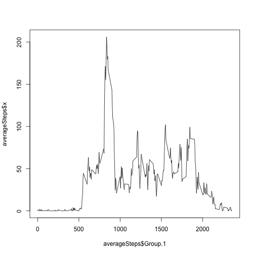
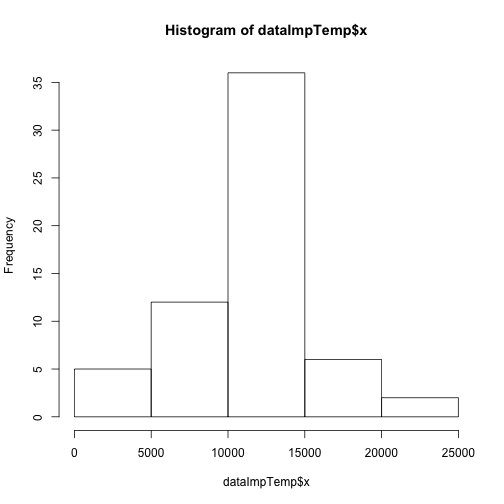
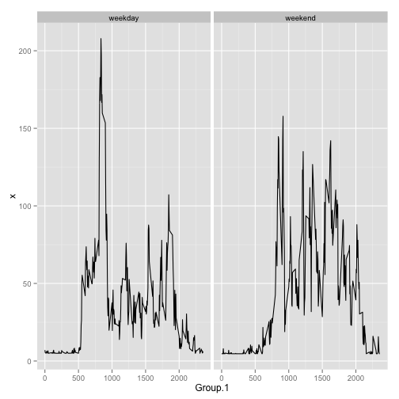

# Reproducible Research: Peer Assessment 1
We're going to work whith data from a personal activity monitoring device. This device collects data at 5 minute intervals through out the day. The data consists of two months of data from an anonymous individual collected during the months of October and November, 2012 and include the number of steps taken in 5 minute intervals each day
## Loading and preprocessing the data
The first step is load the data. We create a dataset named data which contains the original data

```r
# Load raw data
data <- read.csv("/Users/gaspar/Dropbox/Cursos/Coursera/ReproducibleResearch/Assessment1/RepData_PeerAssessment1/activity.csv", 
    header = TRUE, fill = TRUE, na.strings = "NA")
```

## What is mean total number of steps taken per day?
### Histogram of the total number of steps taken each day

```r
# temp contains the total number of steps each day
temp <- aggregate(data$steps, list(data$date), FUN = sum)
# draw the histogram
hist(temp$x)
```

 

### Calculate and report the mean and median total number of steps taken per day
The mean and median total number of steps taken per day can be computed using the dataset temp and the summary() function.

```r
summary(temp)
```

```
##        Group.1         x        
##  2012-10-01: 1   Min.   :   41  
##  2012-10-02: 1   1st Qu.: 8841  
##  2012-10-03: 1   Median :10765  
##  2012-10-04: 1   Mean   :10766  
##  2012-10-05: 1   3rd Qu.:13294  
##  2012-10-06: 1   Max.   :21194  
##  (Other)   :55   NA's   :8
```

We can see that the mean total number of steps is 10766 and the median total number of steps is 10765.
## What is the average daily activity pattern?
### Time series plot
To analyse the daily pattern we have to compare the intervals between days. This is, the 5-minute interval and the average number of steps taken, averaged across all days.

```r
# averageSteps contains the average number of steps per interval
averageSteps <- aggregate(data$steps, list(data$interval), FUN = mean, na.rm = TRUE)
plot(averageSteps$Group.1, averageSteps$x, type = "l")
```

 

### Which 5-minute interval, on average across all the days in the dataset, contains the maximum number of steps?
To answer this question we're going to inspect the maximum peak in the time series graph that corresponds to values above 150 steps.

```r
averageSteps[which(averageSteps$x > 150), ]
```

```
##     Group.1     x
## 100     815 157.5
## 101     820 171.2
## 102     825 155.4
## 103     830 177.3
## 104     835 206.2
## 105     840 195.9
## 106     845 179.6
## 107     850 183.4
## 108     855 167.0
```

```r
which.max(averageSteps$x)
```

```
## [1] 104
```

The maximum number of steps corresponds with the interval 835 (number 140 in the averageSteps dataset) that has a mean value of 206.2 steps
## Imputing missing values
### Calculate and report the total number of missing values in the dataset
The missing data values in the dataset is equal to the number of N.As that I can see with the summary function.

```r
summary(data)
```

```
##      steps               date          interval   
##  Min.   :  0.0   2012-10-01:  288   Min.   :   0  
##  1st Qu.:  0.0   2012-10-02:  288   1st Qu.: 589  
##  Median :  0.0   2012-10-03:  288   Median :1178  
##  Mean   : 37.4   2012-10-04:  288   Mean   :1178  
##  3rd Qu.: 12.0   2012-10-05:  288   3rd Qu.:1766  
##  Max.   :806.0   2012-10-06:  288   Max.   :2355  
##  NA's   :2304    (Other)   :15840
```

The total numner of missing values in the data set is 2304.
### Filling in all of the missing values in the dataset
We're going to impute to the missing values the value of the mean number of steps, that, as we can see in the summary data is equal to 37.383.

```r
# Duplicate of the original data
dataImp <- data
# We substitute the missing values (NA`s) with the mean value of steps
dataImp[which(is.na(dataImp$steps)), "steps"] <- 37.383
```

### Histogram of the total number of steps taken each day with the imputations

```r
dataImpTemp <- aggregate(dataImp$steps, list(dataImp$date), FUN = sum)
# draw the histogram
hist(dataImpTemp$x)
```

 

As we expected the histogram has the same shape but with different frequencies.
## Are there differences in activity patterns between weekdays and weekends

```r
# Creation of the new factor variable in the dataset with two levels
dataImp$weekday <- as.factor(weekdays(as.Date(dataImp$date)))
levels(dataImp$weekday) <- c("weekend", rep("weekday", 4), "weekend", "weekday")
averageStepsImp.weekday <- aggregate(dataImp[which(dataImp$weekday == "weekday"), 
    ]$steps, list(dataImp[which(dataImp$weekday == "weekday"), ]$interval), 
    FUN = mean, na.rm = TRUE)
averageStepsImp.weekday$weekday <- "weekday"
averageStepsImp.weekend <- aggregate(dataImp[which(dataImp$weekday == "weekend"), 
    ]$steps, list(dataImp[which(dataImp$weekday == "weekend"), ]$interval), 
    FUN = mean, na.rm = TRUE)
averageStepsImp.weekend$weekday <- "weekend"
averageStepsImp <- rbind(averageStepsImp.weekday, averageStepsImp.weekend)
# Panel plot with ggplot2
library(ggplot2)
```

```
## Warning: package 'ggplot2' was built under R version 2.15.2
```

```r
ggplot(data = averageStepsImp, aes(x = Group.1, y = x)) + geom_line() + facet_grid(. ~ 
    weekday)
```

 

We can see that the activity patterns look different, with less variation in the weekends.
