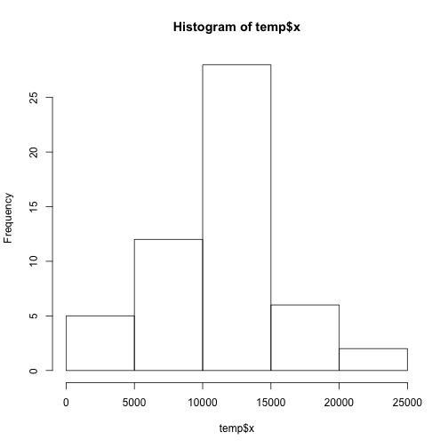

# Reproducible Research: Peer Assessment 1

## Loading and preprocessing the data
Para cargar los datos

```r
# Cargamos los datos originales
data <- read.csv("/Users/gaspar/Dropbox/Cursos/Coursera/ReproducibleResearch/Assessment1/RepData_PeerAssessment1/activity.csv", 
    header = TRUE, fill = TRUE, na.strings = "NA")
summary(data)
```

```
##      steps               date          interval   
##  Min.   :  0.0   2012-10-01:  288   Min.   :   0  
##  1st Qu.:  0.0   2012-10-02:  288   1st Qu.: 589  
##  Median :  0.0   2012-10-03:  288   Median :1178  
##  Mean   : 37.4   2012-10-04:  288   Mean   :1178  
##  3rd Qu.: 12.0   2012-10-05:  288   3rd Qu.:1766  
##  Max.   :806.0   2012-10-06:  288   Max.   :2355  
##  NA's   :2304    (Other)   :15840
```

## What is mean total number of steps taken per day?
### Histogram of the total number of steps taken each day

```r
temp <- aggregate(data$steps, list(data$date), FUN = sum)
hist(temp$x)
```

 


## What is the average daily activity pattern?


## Imputing missing values


## Are there differences in activity patterns between weekdays and weekends?
